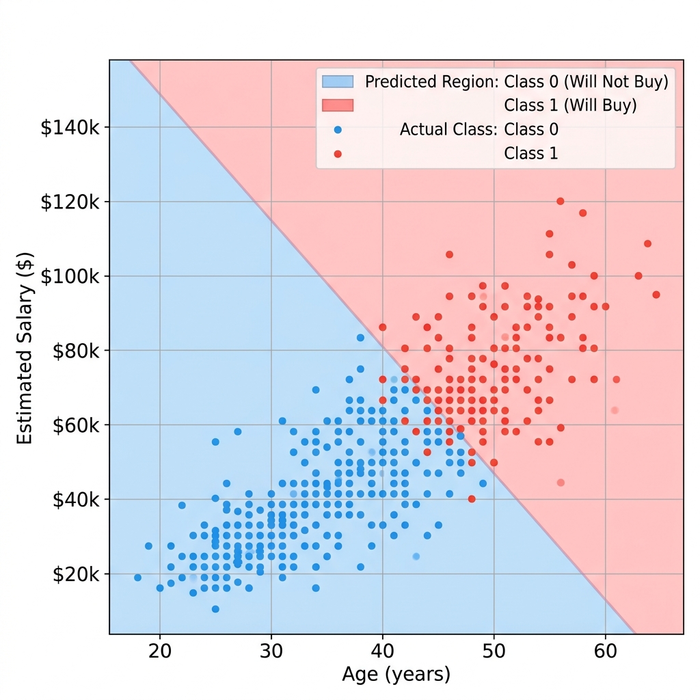

# 🛒 Customer Purchase Prediction using Machine Learning

## 📌 Overview

Customer behavior prediction is a critical component of modern marketing and sales strategies. This project uses Machine Learning to predict whether a customer is likely to purchase a product based on demographic and financial information.

The model is trained on historical customer data and uses **Age** and **Salary** as predictive features. A Logistic Regression classifier is optimized using Grid Search Cross Validation and then saved for reusable inference without requiring retraining.

---

## 🎯 Objectives

* Predict customer purchase decisions.
* Build an end-to-end machine learning pipeline.
* Perform hyperparameter optimization.
* Save trained models for future inference.
* Demonstrate production-ready ML practices.

---

## 📊 Dataset Information

The dataset contains customer demographic and financial information collected from previous marketing campaigns.

| Feature | Description                         |
| ------- | ----------------------------------- |
| Age     | Customer age                        |
| Salary  | Annual salary                       |
| Status  | Target variable (Purchase Decision) |

### Target Labels

| Value | Meaning                   |
| ----- | ------------------------- |
| 0     | Customer did not purchase |
| 1     | Customer purchased        |

### Dataset Characteristics

* Binary Classification Problem
* Numerical Features
* Customer Behavior Prediction
* Marketing Analytics Use Case

---

## 🏗️ Machine Learning Pipeline

`	ext
Load Dataset
      ↓
Data Inspection
      ↓
Feature Selection
      ↓
Train-Test Split
      ↓
Feature Scaling
      ↓
GridSearchCV
      ↓
Logistic Regression
      ↓
Model Evaluation
      ↓
Model Persistence
      ↓
Inference
`

---

## 🤖 Model Used

### Logistic Regression

Logistic Regression is a supervised learning algorithm commonly used for binary classification problems.

The model estimates the probability that a customer will purchase a product based on the provided input features.

### Hyperparameter Optimization

Grid Search Cross Validation was used to identify the optimal regularization strength.

`python
C = [0.01, 0.1, 1, 10, 100]
`

### Cross Validation

* 5-Fold Cross Validation
* Scoring Metric: Accuracy
* Automatic Best Model Selection

---

## 📈 Model Performance & Visualisation

| Metric           | Value               |
| ---------------- | ------------------- |
| Algorithm        | Logistic Regression |
| Cross Validation | 5-Fold              |
| Test Accuracy    | 80.00%              |

The model successfully identifies customer purchasing behavior with an accuracy of approximately **80%** on unseen test data.

### Decision Boundary Visualization
Below is the visualization of the model decision boundary showing the classification regions vs the actual dataset points:

---

## 💾 Model Persistence

To avoid retraining the model every time predictions are required, the trained artifacts are stored using Joblib.

### Saved Artifacts

| File                | Purpose                           |
| ------------------- | --------------------------------- |
| scaler.joblib       | Feature Standardization           |
| logreg_model.joblib | Trained Logistic Regression Model |

This enables fast deployment and real-time predictions.

---

## 🔮 Customer Prediction Workflow

`	ext
User Input
(Age, Salary)
      ↓
Load Scaler
      ↓
Feature Scaling
      ↓
Load Trained Model
      ↓
Prediction
      ↓
Buy / Not Buy
`

---

## 📂 Repository Structure

`	ext
Customer-Purchase-Prediction---ML/
│
├── DigitalAd_dataset.csv
├── customer_purchase_prediction.py
├── train_best_model.py
├── predict_customer.py
├── scaler.joblib
├── logreg_model.joblib
├── README.md
└── images/
    └── customer_purchase_prediction.png
`

---

## ⚙️ Installation

### Clone Repository

`ash
git clone https://github.com/your-username/Customer-Purchase-Prediction---ML.git
cd Customer-Purchase-Prediction---ML
`

### Install Dependencies

`ash
pip install pandas numpy scikit-learn joblib matplotlib
`

---

## 🚀 Training the Model

To retrain the model using the latest dataset:

`ash
python train_best_model.py
`

This will generate:

`	ext
scaler.joblib
logreg_model.joblib
`

containing the updated trained artifacts.

---

## 🔍 Making Predictions

Run the inference utility:

`ash
python predict_customer.py
`

Example:

`	ext
Enter Age: 35
Enter Salary: 60000
`

Output:

`	ext
Customer will Buy
`

or

`	ext
Customer won't Buy
`

---

## 🛠️ Technology Stack

| Category              | Tools         |
| --------------------- | ------------- |
| Language              | Python 3      |
| Data Analysis         | Pandas, NumPy |
| Machine Learning      | Scikit-Learn  |
| Hyperparameter Tuning | GridSearchCV  |
| Model Persistence     | Joblib        |
| Visualization         | Matplotlib    |

---

## 🎓 Key Learnings

* Binary Classification
* Logistic Regression
* Feature Scaling
* Hyperparameter Optimization
* Cross Validation
* Model Persistence
* Production-Oriented ML Workflow

---

## 🚀 Future Enhancements

* Add additional customer features
* Compare multiple classification algorithms
* Precision, Recall and F1 Evaluation
* ROC-AUC Analysis
* Streamlit Web Application
* Flask REST API Deployment
* Real-Time Customer Analytics Dashboard

---

## ⚠️ Disclaimer

This project is intended for educational and research purposes only. Predictions are based on historical data and should not be considered guaranteed indicators of actual customer behavior.

---

## 👨💻 Author

**Lithesh**

Machine Learning Enthusiast | AI Developer | Data Science Learner

⭐ If you found this project useful, consider starring the repository.
